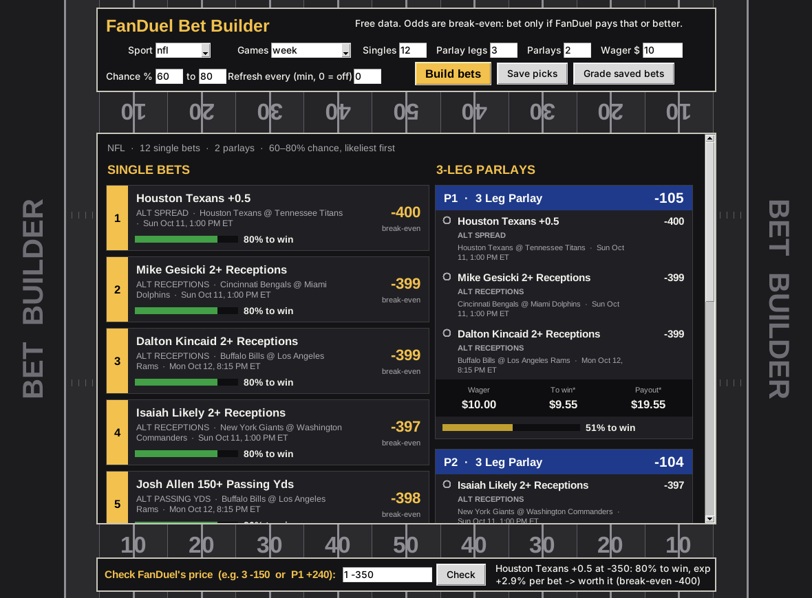
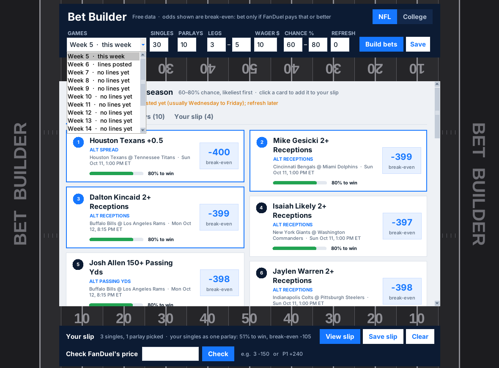
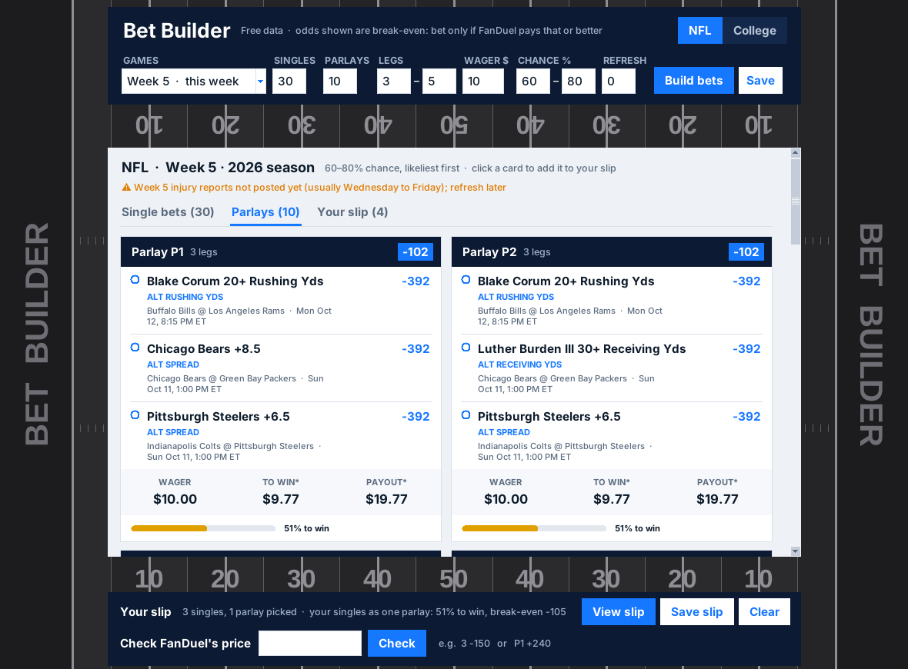
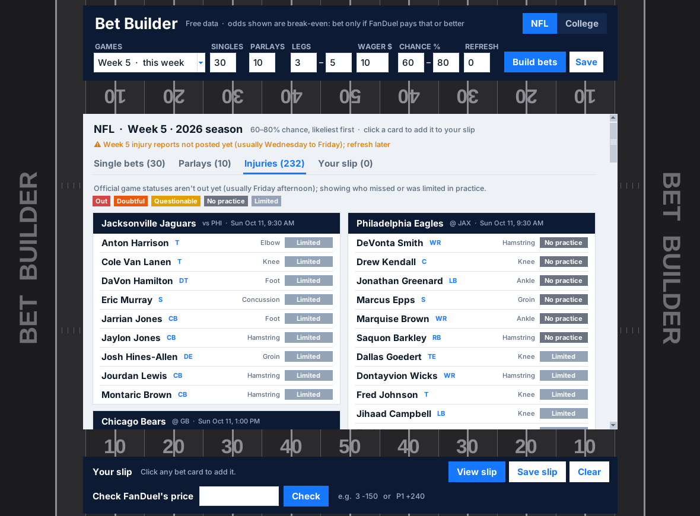
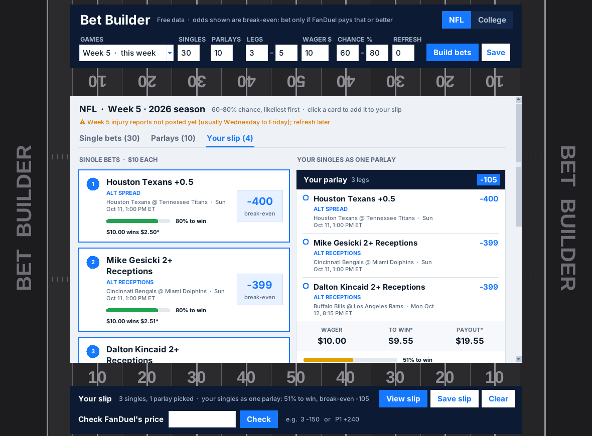

# nfl_edge: find +EV NFL bets on FanDuel

No program can make you win every bet. What *can* give you a long-run edge
is betting only when **FanDuel pays more than the true odds**. This tool:

1. Pulls live NFL moneyline, spread and total prices from FanDuel and other
   books via [The Odds API](https://the-odds-api.com).
2. Builds a **fair (no-vig) probability** for each line from sharp books
   (Pinnacle, Circa, BetOnline, LowVig) by removing their margin.
3. Compares each FanDuel price to that fair probability and lists the bets
   with **positive expected value**, sorted by edge.
4. Blends in a **game model**: this season's team ratings adjusted for
   injuries, starting QB, travel, divisional games and weather (see below).
   Rest days are deliberately ignored.
5. Suggests a stake with **fractional Kelly** sizing (quarter Kelly, capped
   at 2% of bankroll by default).

Sharp-book closing lines are the best public predictor of NFL outcomes.
When FanDuel lags behind a sharp move or shades a side, that gap is your edge.

## Quick start: the bet builder (no API key needed)



The window opens with this week's **top 30 single bets** and **10 parlays of
3 to 5 legs**, each on its own tab: **Single bets**, **Parlays** and
**Your slip**.

**Choosing a week:** the **Games** list shows this week and every later week
on the schedule, labeled with what's known right now:

- **This week** and **lines posted:** full picks, meaning game lines,
  alternate lines, team totals and player props.
- **No lines yet:** moneylines from the stats model only, labeled as such.
  A week fills in automatically once its lines and injury reports come out.
- **Today's games** is also available.



- **Building a slip:** click any card to add it to **your slip**. The slip
  bar shows your picks, plus the chance if your singles were combined into
  one parlay. **View slip** shows them as slips, and **Save slip** stores
  them for grading.
- **Parlays can share games:** a week doesn't have enough games for 10
  parlays without overlap. Each parlay still uses different games for its
  own legs, and no bet appears in more than three parlays.
- **Stays current:** every time it builds, it pulls the latest schedule,
  lines, injury reports and stats. Players listed **Out** or **Doubtful**
  are dropped, **Questionable** players get a **Q** badge, and a status
  line says whether this week's injury reports are in yet. It moves to the
  next week automatically once the current games are played.



**Injuries tab:** every player on the selected week's NFL injury report,
grouped by team. Each one shows a status badge (**Out**, **Doubtful**,
**Questionable**) and a one- or two-word injury, like "Knee", "Hamstring" or
"Rest".

- **Official statuses:** they come from ESPN's live NFL injury report, which
  updates within minutes of the NFL's Friday afternoon release. nflverse's
  copy usually arrives overnight and is the fallback. Injury data refreshes
  at least every 30 minutes.
- **Before Friday:** until a team's official statuses post, the tab lists
  that team's players who missed (**No practice**) or were **Limited** in
  practice, and says so.
- **On bet cards:** props get a **Q** or **DNP** badge when the player is
  questionable or missed practice. Players ruled Out or Doubtful are dropped.
- **Console:** `python3 bets.py --injuries` prints the same list.





**Download the standalone program** (no Python needed): on GitHub, open
**Actions → Build executables**, pick the latest green run, and download
from **Artifacts**:

- **Bet Builder by Levi Shoaf - Windows:** `Bet Builder by Levi Shoaf.exe`,
  the window above, and `Bet Builder by Levi Shoaf (Console).exe`, the text
  version.
- **Bet Builder by Levi Shoaf - Mac:** `Bet Builder by Levi Shoaf - Mac App.zip`,
  the window app, and `Bet Builder by Levi Shoaf - Mac Console.zip`, the text
  version.

Unzip and double-click.

- **Windows:** if SmartScreen warns about an unknown app, click **More info →
  Run anyway**.
- **Mac:** right-click → **Open** the first time.

With Python 3.10+ installed, run `python3 bets_gui.py` for the window, or
double-click `Bets.command` (Mac) or `Bets.bat` (Windows), or run
`python3 bets.py` for the text version.

**What it does.** Choose **1** to build bets: pick the sport, which games
(this week, today, or a date), how many single bets and parlays, the parlay
wager, and whether to auto-refresh. Everything comes from free public data,
with no account or key:

- **NFL game lines:** nflverse consensus moneylines, spreads and totals.
- **Alternate lines:** spreads, totals and team totals, priced from those
  lines and real NFL results since 2015.
- **Player props:** yards, receptions, passing TDs and anytime TD "X+" lines,
  from game logs scaled to each team's expected points. Players who missed
  most of a season, or their team's latest game, are skipped.
- **College:** moneylines from the college model.

**Reading the output:**

- **Single bets** come likeliest first, within a 60–80% chance range
  (`--min-prob` / `--max-prob`). Higher than 80% pays very little.
- **Parlays** print as FanDuel-style slips. Legs come from different games,
  and no two parlays share a game.
- **Odds shown are break-even prices,** the worst price still worth taking,
  because FanDuel's own prices aren't public. At the end, a **price
  checker** lets you type a pick number and FanDuel's odds (`3 -150` or
  `P1 +240`). It tells you the expected value and whether the bet is worth
  it.

**Auto-refresh** is on by default every 5 minutes, with a countdown to the
next update (the **Refresh** box in the window; 0 turns it off, or
`--watch 5` in the text version). Each update reloads injury reports
(official statuses included), lines and weather, and marks **NEW** picks,
**chance moved** and **dropped** picks.
**Save** picks to grade later: start the program and choose **2**, or run
`--grade`.

```bash
python3 bets.py --sport nfl --singles 30 --legs 4 --parlays 3
python3 bets.py --sport ncaaf --date today --legs 2
python3 bets.py --sport nfl --watch 30 --save
```

The advanced command-line tool (`python -m nfl_edge`, below) can still
compare live FanDuel prices with an Odds API key.

## Setup

Requires Python 3.10+ and no third-party packages.

1. Get a free API key at https://the-odds-api.com (500 credits/month).
2. `export ODDS_API_KEY=your_key`

## Usage

```bash
python -m nfl_edge --demo            # try it on bundled sample data
python -m nfl_edge                   # live odds
python -m nfl_edge --bankroll 500 --min-ev 2
python -m nfl_edge --markets h2h --regions us,eu   # cheaper: 2 credits
python -m nfl_edge --json
python -m nfl_edge --parlays         # also suggest parlays
```

| Option | Default | Meaning |
|---|---|---|
| `--min-ev` | `1.0` | Minimum edge in % to show a bet |
| `--min-books` | `2` | Reference books that must offer the exact same line |
| `--devig` | `power` | `power` or `multiplicative` vig removal |
| `--all-books` | off | Average all books instead of preferring sharp ones |
| `--bankroll` | `1000` | Bankroll for stake sizing |
| `--kelly` | `0.25` | Kelly multiplier |
| `--max-bet` | `2.0` | Stake cap as % of bankroll |
| `--model-weight` | `0.1` | Max weight of the stats model in the blend (0 = market only) |
| `--require-agreement` | off | Only show bets the stats model also favors |
| `--ratings` | off | Print this season's team power ratings |
| `--explain` | off | Show what drives each recommended game's projection |
| `--no-weather` | off | Skip weather forecasts |
| `--data-dir` | download | Folder with `injuries_YYYY.csv` / `snap_counts_YYYY.csv` |
| `--no-stats` | off | Skip the stats model |
| `--parlays` | off | Suggest parlays with the highest chance of winning |
| `--max-legs` | `3` | Max legs per parlay |
| `--parlay-count` | `5` | Parlays to show |
| `--parlay-min-ev` | `1.0` | Minimum parlay EV in % |
| `--parlay-wager` | Kelly stake | Show slips for a fixed wager |
| `--parlay-legs` | off | Single most likely parlay with exactly N legs (may be -EV) |
| `--season` | current | Season to pull stats from |
| `--stats-file` | nflverse | Local `games.csv` path or URL |

Each live run costs `markets × regions` API credits (6 with the defaults).
Keep `eu` in `--regions`, since that is where Pinnacle comes from.

## Game model

All data is free and needs no extra keys. It's cached in `~/.cache/nfl_edge`
(override with `NFL_EDGE_CACHE`).

| Factor | Source | How it's used |
|---|---|---|
| Team strength | nflverse results, this season | Offense/defense ratings (ridge regression on points scored and allowed) |
| Starting QB | nflverse injury report + starts | Usual starter Out/Doubtful/Questionable |
| Other injuries | Injury report × snap counts | Each Out/Doubtful/Questionable player weighted by how much he plays |
| Travel | Stadium coordinates | Extra miles the away team travels |
| Home field | Schedule | Removed for neutral and international games |
| Divisional game | Schedule | Familiar opponents play closer games |
| Weather | Open-Meteo forecast at kickoff | Wind over 10 mph and cold below 45°F, outdoor games only |
| Dome | Schedule | Indoor scoring environment |

How much each factor is worth isn't guessed. `python -m nfl_edge.backtest
--write` fits it on 2015–2025 and stores it in `nfl_edge/factors.json`. Every
game is rebuilt using only information available before kickoff. Each
estimate is then shrunk toward zero according to its uncertainty, so noisy
factors barely count. Current fitted values:

- **Starting QB out:** about 3.1 points of margin and 2.8 fewer total points.
- **Wind:** about 0.33 fewer points per mph above 10 mph.
- **Injuries:** a full-time defensive starter out adds about 0.7 to the
  opponent's margin.
- **Travel, divisional:** small.

`--explain` prints the breakdown for each game you're told to bet (illustrative output):

```
IND @ PIT: projected IND 22.4 - PIT 24.0 (total 46.4)
  team ratings alone: IND 22.6 - PIT 23.8
  home field           PIT +0.4 margin
  - forecast 48F, wind 14 mph
```

The final probability is `(1 - w) * market + w * model`. `w` is
`--model-weight` (default 0.1), scaled down until both teams have played
8 games.

### What the backtest says

Out-of-sample results: fit on 2015–2020, tested on 1,196 games in 2021–2025.

| Prediction | Win log loss | Margin error | Total error |
|---|---|---|---|
| Closing market line | **0.608** | **9.85** | **10.26** |
| Team ratings only | 0.647 | 10.46 | 10.76 |
| Ratings + all factors | 0.640 | 10.39 | 10.58 |
| Market + 10% model | 0.609 | 9.86 | 10.26 |

The factors are real: they improve the model. But the closing market
already prices them in, and nothing beats it. The model picked the right
side of the closing spread 48.5% of the time (52.4% is break-even). The
backtest also asks whether the market under-reacts to any factor; none
showed a significant gap.

So where does the edge come from? From **FanDuel lagging the sharp books**,
which the finder catches directly. The model is a second opinion and a
sanity check. Use `--require-agreement` to drop bets it disagrees with, or
`--model-weight 0` for market only.

Rerun the backtest yourself (takes about 15 seconds):

```bash
python -m nfl_edge.backtest
```

## Parlays

`--parlays` builds 2–3 leg parlays and ranks them by **chance of winning**.
It only shows parlays with positive expected value.

Each parlay prints like a FanDuel bet slip. This one is from the demo
data, with `--parlay-wager 10`:

```
┌──────────────────────────────────────────────────┐
│ 2 Leg Parlay                                +153 │
├──────────────────────────────────────────────────┤
│ ● Cincinnati Bengals -6.5                   -102 │
│   SPREAD                                         │
│   Cincinnati Bengals @ Miami Dolphins            │
│   Sun Oct 11, 1:00 PM ET                         │
│                                                  │
│ ● Houston Texans                            -360 │
│   MONEYLINE                                      │
│   Houston Texans @ Tennessee Titans              │
│   Sun Oct 11, 1:00 PM ET                         │
├──────────────────────────────────────────────────┤
│ Wager $10.00                       To Win $15.31 │
│ Total Payout                              $25.31 │
├──────────────────────────────────────────────────┤
│ Our estimate: 40.1% to win, EV +1.4%             │
└──────────────────────────────────────────────────┘
```

Without `--parlay-wager`, the wager is the suggested Kelly stake.

How they're built:

- **Only +EV legs.** Every leg must pay more than its true odds, including
  small edges (0–1%) that aren't worth betting alone. FanDuel's margin
  compounds with every leg. Two ordinary -110 coin flips are -4.5% as
  singles but -8.9% as a parlay, so a parlay of "likely winners" without an
  edge is a fast way to lose. With +EV legs, the edges compound in your favor.
- **Different games only.** Legs in the same game move together (a team
  covering and its moneyline, or a blowout and the over). FanDuel prices
  those as same-game parlays with its own adjustment, which this tool can't
  see, so it never combines them.
- **Favorites rise to the top.** Ranking by win probability favors heavy
  favorites and pairs. More legs always means a lower chance of winning.
- **Smaller stakes.** Stakes use the same fractional Kelly as singles. That
  naturally sizes parlays smaller, because they lose more often.

### Big parlays

`--parlay-legs N` builds the single most likely parlay with exactly N legs.
It takes the most likely outcome in each game, then the N games where that
outcome is most likely. Those legs aren't required to have an edge, so the
slip also shows the parlay's fair odds and expected loss.

For example, an 11-leg parlay of the favorites for week 5 of 2026, using
consensus lines:

| | |
|---|---|
| Legs | 11 favorites on the moneyline, from -148 to -425 |
| Pays | +6615 ($10 wins $661) |
| Chance of winning | **about 1%** (fair odds +9972) |
| Expected value | **-33%** |

Every leg adds FanDuel's margin again, so long parlays of favorites are
among the worst-value bets on the board.

Keep in mind:

- **A parlay's chance is the product of its legs.** Even the best one here
  wins only about 40% of the time.
- **The stakes overlap.** Every suggested stake assumes it's your only bet.
  If you play several parlays that share a leg, they win and lose together;
  cut each stake accordingly.
- **Check the payout.** FanDuel's standard parlay payout is the product of
  the legs' odds, but confirm it on the bet slip. Don't count profit boosts
  or insurance until you see them there.

## College football

```bash
python -m nfl_edge --sport ncaaf --explain
python -m nfl_edge --sport ncaaf --parlays
python -m nfl_edge.cfb_backtest        # about 2 minutes
```

The odds side works exactly like the NFL one: FanDuel is compared with sharp
books through The Odds API (`americanfootball_ncaaf`). The stats side uses
the free [cfbfastR-data](https://github.com/sportsdataverse/cfbfastR-data)
repository: season schedules with scores and Elo ratings, and historical
betting lines for the backtest.

**How the college model differs from the NFL one:**

- **Starts from preseason Elo.** By October a college team has played about
  5 games, often against much weaker opponents. Ratings start from each
  team's preseason Elo and move with this season's scores.
- **Pooled FCS opponents.** All FCS teams share one pooled rating.
- **Current Elo blended in.** The projected margin is half the ratings and
  half the current Elo.
- **College-sized constants.** Home field is about 3.6 points, and results
  vary more: about 16.5 points around the margin, 16 around the total.
- **No injury, QB or weather adjustments.** There's no free source for
  those.

**Backtest:** settings chosen on 2023–2024, tested on 664 FBS games in 2025
that the fit never saw, against the consensus closing line.

| Prediction | Win log loss | Margin error | Total error |
|---|---|---|---|
| Closing consensus line | 0.5300 | **11.88** | **12.26** |
| College model | 0.5285 | 12.28 | 12.80 |
| Market + 10% model | **0.5283** | 11.88 | 12.26 |

- **Winners:** the model picks winners about as well as the closing line,
  slightly better in this test.
- **Margins and totals:** worse than the line.
- **Big disagreements:** when the model and the spread differed by 5+
  points, the model's side covered 82 of 151 times (54.3%). That's
  promising, but too few games to call it a proven edge.

As with the NFL, the reliable edge is FanDuel lagging the sharp books, not
the model.

## Using it well

- **Act fast.** Edges close within minutes. Run it close to when you bet,
  and check that FanDuel's price hasn't moved.
- **Edges are small.** Expect 1–5%. Profit comes from volume and
  discipline, not from any single bet. Losing streaks of 10+ bets are normal.
- **Track closing line value (CLV).** If your bets regularly beat the
  closing line, you're doing it right, even during a losing stretch.
- **Expect limits.** FanDuel restricts accounts that consistently beat its
  lines.
- Only bet where it's legal for you, and only what you can afford to lose.
  Problem gambling help: 1-800-GAMBLER.

## Tests

```bash
python -m unittest discover -t . -s tests
```
