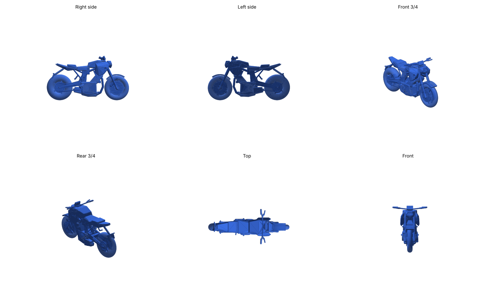

# Yamaha MT-07 (2025) — 3D-printable scale model

A stylized 1:18 model of the 2025 Yamaha MT-07, generated in Python with
[manifold3d](https://github.com/elalish/manifold), which always produces watertight meshes.



## Files

| File | Size at 1:18 | How to print |
|---|---|---|
| `stl/mt07_full.stl` | 118 × 47 × 63 mm | One piece on a display base. Print upright with tree/organic supports. |
| `stl/mt07_half_left.stl` + `stl/mt07_half_right.stl` | 112 × 60 × 23 mm each | Cut face down, **no supports**. Glue the halves together. |

For the halves, push 3.5 mm pieces of 1.75 mm filament into the two 2.1 mm holes
to line them up, then glue (CA or plastic cement).

Suggested settings: 0.4 mm nozzle, 0.12–0.16 mm layers, 3 walls, 15 % infill.
PLA or PETG works well. Paint suggestion: Icon Blue tank and shrouds with a
black frame, engine and wheels.

## Rebuild or rescale

```bash
pip install manifold3d numpy matplotlib
python3 mt07.py --scale 12 --preview   # 1:12 (about 177 mm long)
```

The model uses real dimensions (1395 mm wheelbase, 805 mm seat height,
120/70-17 and 180/55-17 tyres, 24.8° rake). Small parts such as brake discs,
levers and footpegs are thickened so they survive printing at 1:18.
Mirrors and fine details like chain links are left out because they would be too fragile.
